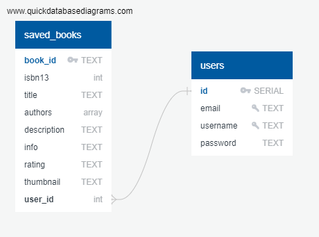

# Book Carousel

Book Carousel is your go-to book comparison shopping website.

The site is deployed [here](https://book-carousel.herokuapp.com/).

### Data

##

API Used:

- The [Google Books API](https://developers.google.com/books/docs/v1/using) is used to display information such as the title, author, and genre for the books that are returned as the search results.

### Features

##

- Ability to search for a book by title, author, or ISBN and filter the results by release date, genre, or E-book availability
- Book Cards: show a given book's title, description, author, ISBN13, and rating and has options to purchase or learn more about the book
- User can save a given book to "Saved Books" (Must be logged in)
- In the User's "Saved Books", User can further filter their saved books by searching for a book's author, title, or ISBN. User can also remove a book from their saved books.
- User can create, edit, or delete their account (account creation not necessary to use app)

### User Flow

##

1. On the homepage, User will see a search bar that allows them to search for a book.
2. Pages of book results will be returned, and User can click on a given book card and discover more information about the book
3. User can click to save book to their "Saved Books" and then click to be directed to their saved books.
4. There are links in the navbar to allow User to create an account, login/logout, and view their saved books

### Tech Stack

##

- Backend: Python, Flask, PostgreSQL, SQLAlchemy
- Frontend: jQuery

### Database Design

##

An overview of how the database is set up.  

### Tests

##

Tests are currently only compatible in WSL/Linux

Follow Along to get them running: 

1. Remove the # at the beginning of line 21 in the app.py
2. In your terminal, run this command   python3 -m unittest tests.py
3. Your terminal may or may not tell you to remove the 3 in python3 in the command you just ran depending on what version of python you are running.
4. Optional - Inspect all of the tests in tests.py to see what is being tested.